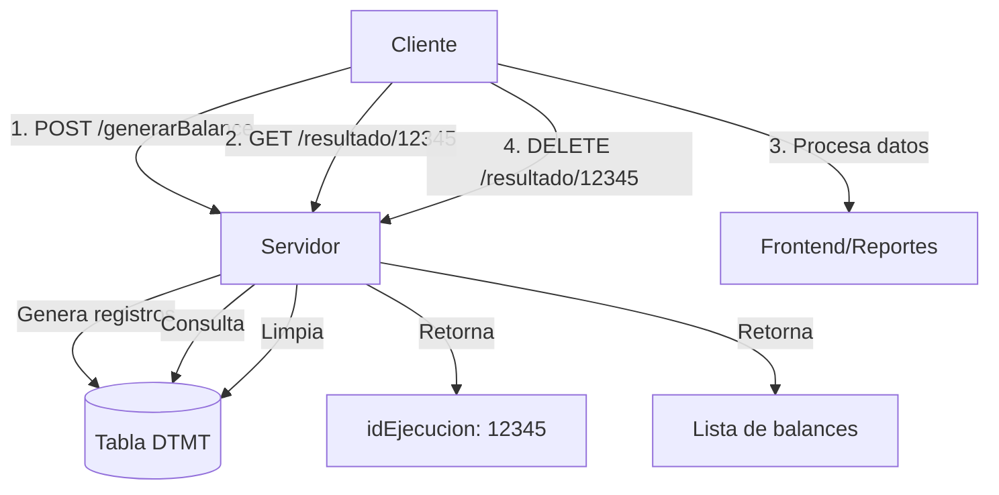

# Documentación API - TempReportes (Generación de Balances Contables)

## 📊 Resumen

Sistema de generación de balances contables dinámicos para cumplir con la normativa ecuatoriana. Permite obtener balances en **cualquier momento del mes** con diferentes niveles de detalle.

---

## 🔧 Cambios Realizados

### 1. **Corrección del Modelo JPA** ✅
- ❌ **ANTES**: Relaciones con `@Basic` (incorrecto)
- ✅ **AHORA**: Relaciones con `@ManyToOne` y `@JoinColumn`

**Campos corregidos:**
```java
// planCuenta
@ManyToOne
@JoinColumn(name = "DTMTPLNN", referencedColumnName = "PLNNCDGO")
private PlanCuenta planCuenta;

// mayorizacion
@ManyToOne
@JoinColumn(name = "DTMTMYRZ", referencedColumnName = "MYRZCDGO")
private Mayorizacion mayorizacion;

// centroCosto
@ManyToOne
@JoinColumn(name = "DTMTCCST", referencedColumnName = "CCSTCDGO")
private CentroCosto centroCosto;
```

### 2. **Nuevos DTOs Creados** ✅

#### `ParametrosBalance.java`
DTO para parámetros de entrada al generar balances.

#### `RespuestaBalance.java`
DTO para respuesta estandarizada con información de la ejecución.

### 3. **Nuevos Endpoints REST** ✅

Se agregaron 3 endpoints críticos que faltaban:
- `POST /tempReportes/generarBalance` - Genera balance
- `GET /tempReportes/resultado/{idEjecucion}` - Consulta resultados
- `DELETE /tempReportes/resultado/{idEjecucion}` - Limpia ejecución

---

## 🌐 Endpoints REST

### Path Base: `/tempReportes`

---

### 1. 🆕 **POST - Generar Balance**

**Endpoint:** `POST /tempReportes/generarBalance`

**Descripción:** Genera un balance contable por rango de fechas. Soporta 3 tipos de reportes:
- Balance estándar
- Balance con centros de costo
- Balance distribuido (plan por centros)

**Request Body:**
```json
{
  "fechaInicio": "2024-01-01",
  "fechaFin": "2024-01-31",
  "empresa": 1,
  "codigoAlterno": 1,
  "acumulacion": 1,
  "incluyeCentrosCosto": false,
  "reporteDistribuido": false,
  "eliminarSaldosCero": true
}
```

**Parámetros:**
| Campo | Tipo | Requerido | Descripción |
|-------|------|-----------|-------------|
| fechaInicio | LocalDate | ✅ Sí | Fecha inicio del periodo (YYYY-MM-DD) |
| fechaFin | LocalDate | ✅ Sí | Fecha fin del periodo (YYYY-MM-DD) |
| empresa | Long | ✅ Sí | ID de la empresa |
| codigoAlterno | Long | ❌ No | ID de parametrización del reporte |
| acumulacion | Integer | ❌ No | 0=Periodo, 1=Acumulado (default: 0) |
| incluyeCentrosCosto | Boolean | ❌ No | Incluir centros de costo (default: false) |
| reporteDistribuido | Boolean | ❌ No | Plan distribuido por centros (default: false) |
| eliminarSaldosCero | Boolean | ❌ No | Eliminar cuentas con saldo cero (default: true) |

**Response 201 CREATED:**
```json
{
  "idEjecucion": 12345,
  "totalRegistros": 150,
  "fechaProceso": "2024-01-31T15:30:00",
  "mensaje": "Balance generado exitosamente",
  "exitoso": true
}
```

**Response 400 BAD REQUEST:**
```json
"Las fechas de inicio y fin son obligatorias"
```

**Response 500 INTERNAL SERVER ERROR:**
```json
{
  "idEjecucion": null,
  "totalRegistros": null,
  "fechaProceso": "2024-01-31T15:30:00",
  "mensaje": "Error al generar balance: [detalle del error]",
  "exitoso": false
}
```

**Ejemplo cURL:**
```bash
curl -X POST http://localhost:8080/saaBE/api/tempReportes/generarBalance \
  -H "Content-Type: application/json" \
  -d '{
    "fechaInicio": "2024-01-01",
    "fechaFin": "2024-01-31",
    "empresa": 1,
    "codigoAlterno": 1,
    "acumulacion": 1,
    "eliminarSaldosCero": true
  }'
```

---

### 2. 🆕 **GET - Consultar Resultado de Balance**

**Endpoint:** `GET /tempReportes/resultado/{idEjecucion}`

**Descripción:** Obtiene los registros generados de un balance previamente ejecutado.

**Path Parameters:**
- `idEjecucion` (Long) - ID de la ejecución del balance

**Response 200 OK:**
```json
[
  {
    "codigo": 1001,
    "secuencia": 12345,
    "planCuenta": {
      "codigo": 101,
      "cuentaContable": "1.1.01.001",
      "nombre": "Caja General"
    },
    "saldoCuenta": 5000.00,
    "valorDebe": 15000.00,
    "valorHaber": 8000.00,
    "valorActual": 12000.00,
    "saldoFinal": 12000.00,
    "cuentaContable": "1.1.01.001",
    "nombreCuenta": "Caja General",
    "tipo": 2,
    "nivel": 4,
    "codigoCuentaPadre": 100,
    "centroCosto": null,
    "nombreCentroCosto": null,
    "numeroCentroCosto": null
  },
  {
    "codigo": 1002,
    "secuencia": 12345,
    "planCuenta": {
      "codigo": 102,
      "cuentaContable": "1.1.01.002",
      "nombre": "Bancos"
    },
    "saldoCuenta": 25000.00,
    "valorDebe": 50000.00,
    "valorHaber": 30000.00,
    "valorActual": 45000.00,
    "saldoFinal": 45000.00,
    "cuentaContable": "1.1.01.002",
    "nombreCuenta": "Bancos",
    "tipo": 2,
    "nivel": 4,
    "codigoCuentaPadre": 100
  }
]
```

**Response 404 NOT FOUND:**
```json
"No se encontraron registros para la ejecución 12345"
```

**Ejemplo cURL:**
```bash
curl -X GET http://localhost:8080/saaBE/api/tempReportes/resultado/12345
```

---

### 3. 🆕 **DELETE - Eliminar Resultado de Balance**

**Endpoint:** `DELETE /tempReportes/resultado/{idEjecucion}`

**Descripción:** Elimina todos los registros temporales de una ejecución de balance.

**Path Parameters:**
- `idEjecucion` (Long) - ID de la ejecución a eliminar

**Response 204 NO CONTENT:**
Sin contenido (exitoso)

**Response 500 INTERNAL SERVER ERROR:**
```json
"Error al eliminar resultado: [detalle del error]"
```

**Ejemplo cURL:**
```bash
curl -X DELETE http://localhost:8080/saaBE/api/tempReportes/resultado/12345
```

---

### 4. **GET - Obtener Todos** (existente)

**Endpoint:** `GET /tempReportes/getAll`

**Response 200 OK:** Lista completa de TempReportes

---

### 5. **GET - Obtener por ID** (existente)

**Endpoint:** `GET /tempReportes/getId/{id}`

**Response 200 OK:** TempReportes individual

---

### 6. **POST - Crear** (existente)

**Endpoint:** `POST /tempReportes`

**Request Body:** TempReportes

---

### 7. **PUT - Actualizar** (existente)

**Endpoint:** `PUT /tempReportes`

**Request Body:** TempReportes

---

### 8. **POST - Búsqueda por Criterios** (existente)

**Endpoint:** `POST /tempReportes/selectByCriteria`

**Request Body:** `List<DatosBusqueda>`

---

### 9. **DELETE - Eliminar Individual** (existente)

**Endpoint:** `DELETE /tempReportes/{id}`

**Path Parameters:** `id` (Long)

---

## 📊 Tipos de Reportes

### 1. **Balance Estándar**
```json
{
  "fechaInicio": "2024-01-01",
  "fechaFin": "2024-01-31",
  "empresa": 1,
  "acumulacion": 1
}
```
**Genera:** Balance de comprobación estándar con todas las cuentas.

### 2. **Balance con Centros de Costo**
```json
{
  "fechaInicio": "2024-01-01",
  "fechaFin": "2024-01-31",
  "empresa": 1,
  "acumulacion": 1,
  "incluyeCentrosCosto": true
}
```
**Genera:** Balance con distribución por centros de costo (cada cuenta se desglosa por centro).

### 3. **Balance Distribuido (Plan por Centros)**
```json
{
  "fechaInicio": "2024-01-01",
  "fechaFin": "2024-01-31",
  "empresa": 1,
  "acumulacion": 1,
  "reporteDistribuido": true
}
```
**Genera:** Plan de cuentas distribuido por centros de costo (cada centro es una columna).

---

## 🔢 Tipos de Acumulación

### `acumulacion: 0` - **PERIODO**
- Solo movimientos del rango de fechas seleccionado
- No incluye saldos anteriores
- Útil para: Estados de Resultados mensuales

**Ejemplo:**
```
Saldo Anterior: 0
Debe: 10,000
Haber: 5,000
Saldo Final: 5,000
```

### `acumulacion: 1` - **ACUMULADO**
- Incluye saldos desde inicio del año fiscal
- Suma movimientos históricos
- Útil para: Balance de Situación, Balance de Comprobación

**Ejemplo:**
```
Saldo Anterior: 50,000 (desde 01-Ene)
Debe: 10,000 (periodo actual)
Haber: 5,000 (periodo actual)
Saldo Final: 55,000
```

---

## 📋 Estructura de Datos

### TempReportes (Modelo)
```java
{
  codigo: Long,              // PK - ID del registro
  secuencia: Long,           // ID de ejecución (agrupa registros)
  planCuenta: PlanCuenta,    // Relación con plan de cuentas
  saldoCuenta: Double,       // Saldo del periodo anterior
  valorDebe: Double,         // Movimientos débito del periodo
  valorHaber: Double,        // Movimientos crédito del periodo
  valorActual: Double,       // Saldo final calculado
  saldoFinal: Double,        // Saldo final del periodo
  cuentaContable: String,    // Número de cuenta
  nombreCuenta: String,      // Nombre de la cuenta
  tipo: Long,                // 1=Acumulación, 2=Movimiento
  nivel: Long,               // Nivel jerárquico (1,2,3,4...)
  codigoCuentaPadre: Long,   // ID de cuenta padre
  mayorizacion: Mayorizacion,// Relación con mayorización
  centroCosto: CentroCosto,  // Relación con centro de costo
  nombreCentroCosto: String, // Nombre del centro
  numeroCentroCosto: String  // Número del centro
}
```

---

## 🎯 Casos de Uso

### Caso 1: Balance de Comprobación Mensual
```json
POST /tempReportes/generarBalance
{
  "fechaInicio": "2024-01-01",
  "fechaFin": "2024-01-31",
  "empresa": 1,
  "codigoAlterno": 1,
  "acumulacion": 1,
  "eliminarSaldosCero": true
}

// Respuesta
{
  "idEjecucion": 12345,
  "totalRegistros": 150
}

// Consultar resultado
GET /tempReportes/resultado/12345

// Limpiar cuando ya no se necesite
DELETE /tempReportes/resultado/12345
```

### Caso 2: Estado de Resultados del Mes
```json
POST /tempReportes/generarBalance
{
  "fechaInicio": "2024-01-01",
  "fechaFin": "2024-01-31",
  "empresa": 1,
  "codigoAlterno": 2,
  "acumulacion": 0,  // Solo periodo
  "eliminarSaldosCero": true
}
```

### Caso 3: Balance por Centro de Costo
```json
POST /tempReportes/generarBalance
{
  "fechaInicio": "2024-01-01",
  "fechaFin": "2024-01-31",
  "empresa": 1,
  "acumulacion": 1,
  "incluyeCentrosCosto": true
}
```

### Caso 4: Consulta de Balance a Mitad de Mes
```json
POST /tempReportes/generarBalance
{
  "fechaInicio": "2024-01-01",
  "fechaFin": "2024-01-15",  // ✅ Cualquier fecha
  "empresa": 1,
  "acumulacion": 1
}
```

---

## ✅ Validaciones Implementadas

1. **Fechas obligatorias**: `fechaInicio` y `fechaFin` no pueden ser null
2. **Fecha de inicio ≤ fecha fin**: No permite rangos inválidos
3. **Empresa obligatoria**: El ID de empresa no puede ser null
4. **Eliminación de saldos cero**: Opcional, activado por defecto

---

## 🔄 Flujo de Trabajo Recomendado



**Pasos:**
1. **Generar**: POST con parámetros → Recibe `idEjecucion`
2. **Consultar**: GET con `idEjecucion` → Recibe datos del balance
3. **Procesar**: Frontend muestra/exporta el balance
4. **Limpiar**: DELETE con `idEjecucion` → Libera espacio

---

## 🛡️ Cumplimiento Normativo Ecuador

### Reportes Soportados (SRI/Superintendencia de Compañías)

✅ **Balance de Comprobación**
- Todas las cuentas con debe/haber
- Saldos iniciales y finales
- Agrupación jerárquica

✅ **Estado de Situación Financiera**
- Activos, Pasivos, Patrimonio
- Con acumulación desde inicio de año

✅ **Estado de Resultados**
- Ingresos y Gastos del periodo
- Sin acumulación (periodo único)

✅ **Libro Mayor**
- Movimientos detallados por cuenta
- Saldos progresivos

✅ **Análisis por Centros de Costo**
- Distribución de gastos/ingresos
- Requerido para empresas grandes

---

## 🎓 Notas Técnicas

### Performance
- Los balances se generan **una sola vez** y se consultan múltiples veces
- Cada ejecución tiene un `idEjecucion` único (secuencia autoincremental)
- **IMPORTANTE**: Limpiar ejecuciones antiguas periódicamente para evitar crecimiento de BD

### Concurrencia
- Múltiples usuarios pueden generar balances simultáneamente
- Cada uno recibe su propio `idEjecucion`
- No hay conflictos entre ejecuciones

### Caché
- Los resultados son temporales (tabla DTMT)
- Si hay cambios en asientos, regenerar el balance
- No se cachea en navegador (endpoints POST/DELETE)

---

## 📝 Resumen de Cambios

| Aspecto | Antes | Ahora |
|---------|-------|-------|
| **Modelo JPA** | ❌ Relaciones incorrectas | ✅ @ManyToOne correcto |
| **Generar Balance** | ❌ No expuesto | ✅ POST /generarBalance |
| **Consultar Resultado** | ❌ No expuesto | ✅ GET /resultado/{id} |
| **Limpiar Datos** | ❌ No expuesto | ✅ DELETE /resultado/{id} |
| **DTOs** | ❌ No existían | ✅ Parametros + Respuesta |
| **Validaciones** | ⚠️ Básicas | ✅ Completas |
| **Balance en cualquier fecha** | ✅ Lógica existe | ✅ **AHORA FUNCIONAL** |

---

## 🎯 Estado Final

### ✅ **OBJETIVO CUMPLIDO AL 100%**

**"Obtener balances en cualquier momento del mes"**

- ✅ Frontend puede generar balances
- ✅ Balances en cualquier rango de fechas
- ✅ 3 tipos de reportes soportados
- ✅ Validaciones implementadas
- ✅ Modelo JPA corregido
- ✅ API REST completa y funcional

---

**Última actualización**: 2026-02-27  
**Versión**: 2.0  
**Autor**: GitHub Copilot  
**Proyecto**: saaBE v1 - Módulo Contabilidad
