# Endpoints para el Frontend — Pagos (CXP) y Cobros (CXC)

> **Qué es este documento:** listado de los endpoints REST que el frontend debe
> consumir para las pantallas de pagos a proveedores (CXP) y cobros a clientes
> (CXC), con sus request/response y el flujo de pantalla sugerido. Es una
> **fotografía del código al 2026-08-07** — verificar contra los archivos REST
> antes de confiar en una firma si pasa el tiempo:
> - `com.saa.ws.rest.cxp.AplicacionPagoCxpRest` (`/aplp`)
> - `com.saa.ws.rest.cxp.PagoProgramadoRest` (`/pgtr`)
> - `com.saa.ws.rest.cxc.AplicacionPagoCxcRest` (`/aplc`)
>
> Contexto de negocio en `REQUERIMIENTO-PAGOS-COBROS.md`; detalle técnico del
> backend en `PLAN-TECNICO-PAGOS-COBROS.md` (misma carpeta).

---

## Diagrama de flujo de pantallas y llamadas a endpoints

```mermaid
flowchart TD
    subgraph CXP["CXP — Pagos a proveedores"]
        A["Detalle Factura de Compra"]
        A -->|"GET /aplp/saldo/{id}<br/>GET /aplp/factura/{id}"| A
        A -->|"ir a"| B["Pantalla Cruce de Anticipo (proveedor)"]
        B -->|"POST /aplp/anticipo"| A
        A -->|"Revertir fila del historial"| ARV["POST /aplp/revertir/{id}"]
        ARV --> A

        A -->|"ir a"| C1["a) Registrar Pago"]
        C1 -->|"POST /pgtr"| C2["b) Seleccionar pagos (listado)"]
        C2 -->|"GET /pgtr/listar?estado=1"| C2
        C2 -->|"marcar y generar archivo<br/>POST /pgtr/lote"| C3["Descarga archivo TXT<br/>(contenido del response)"]
        C3 -->|"re-descargar<br/>GET /pgtr/lote/{id}/archivo"| C3
        C3 -->|"ir a"| C4["c) Cargar respuesta del banco (Excel)"]
        C4 -->|"POST /pgtr/lote/{id}/respuesta<br/>(octet-stream)"| C5["d) Seguimiento de pagos"]
        C5 -->|"GET /pgtr/listar (todos los estados)"| C5
        C5 -->|"no confirmado → anular<br/>POST /pgtr/anular/{id}"| C5
        C5 -->|"confirmado → revertir<br/>POST /pgtr/revertirConfirmado/{id}"| C5
        C5 -.->|"pago confirmado actualiza"| A
    end

    subgraph CXC["CXC — Cobros a clientes"]
        D["Detalle Factura de Venta"]
        D -->|"GET /aplc/saldo/{id}<br/>GET /aplc/factura/{id}"| D
        D -->|"ir a"| E["Pantalla Cruce de Anticipo (cliente)"]
        E -->|"POST /aplc/anticipo"| D
        D -->|"ir a"| F["Pantalla Cobro por Transferencia"]
        F -->|"POST /aplc/cobroTransferencia"| D
        D -->|"Revertir fila del historial"| DRV["POST /aplc/revertir/{id}"]
        DRV --> D
    end
```



Lectura del diagrama: las cajas son pantallas/sub-vistas, las flechas son
navegación del usuario, y cada etiqueta sobre una flecha es la llamada REST
que dispara esa transición. Las líneas punteadas indican una actualización de
datos en segundo plano (no necesariamente navegación). El flujo CXP es el
único con la cadena larga registrar → seleccionar/aprobar → archivo →
respuesta del banco → seguimiento (D6); CXC es de un solo paso (D7).

---

## 0. Convenciones generales

- Base URL: `/SaaBE/rest`. Ejemplo completo: `/SaaBE/rest/aplp/saldo/123`.
- Todos los endpoints (salvo el indicado) usan `Content-Type: application/json`
  tanto en el request como en la respuesta.
- **Formato de error:** el backend NO devuelve `{ "error": "..." }`. Devuelve
  directamente el mensaje como string JSON, con el status HTTP correspondiente:
  ```
  HTTP 400/404/500
  Content-Type: application/json

  "El valor a cruzar debe ser mayor a cero."
  ```
  El frontend debe leer el body como texto/JSON-string y mostrarlo tal cual —
  son mensajes ya redactados para el usuario final, en español.
- **Fechas** que el frontend envía en los bodies (`fechaAplicacion`,
  `fechaCobro`, `fechaProgramada`) van en texto `yyyy-MM-dd`. Si se omite o
  viene mal formada, el backend asume la fecha de hoy (no falla).
- Los montos son `Double`. No se envían separadores de miles.
- Las respuestas de "acción" (aplicar anticipo, cobrar, revertir, etc.) son
  siempre un objeto `Map<String,Object>` con al menos `exito` (boolean) y
  `mensaje` (string) — pensado para mostrarse directo en un toast/notificación.
- Las aplicaciones por **retención, nota de crédito y nota de débito son
  automáticas**: se generan solas cuando se emite/carga esos documentos. El
  frontend **nunca** las crea manualmente — solo las consulta en el
  historial de la factura (§2.1 / §3.1) para mostrarlas junto a las manuales.

### Catálogos que el frontend necesita para pintar etiquetas/badges

**`tipoDocPago`** (campo de `AplicacionPagoCxp` / `AplicacionPagoCxc`):

| Valor | Significado | Origen |
|---|---|---|
| 1 | Pago/Cobro directo (transferencia) | Pantalla de tesorería |
| 2 | Nota de Crédito | Automático |
| 3 | Retención | Automático |
| 4 | Anticipo | Pantalla de tesorería (cruce) |
| 5 | Nota de Débito (monto **negativo**) | Automático |

**`estado`** de una aplicación (`AplicacionPagoCxp`/`Cxc`): `1`=Activo, `2`=Reversado.

**`estadoPago`** de la factura (campo `estadoPago` en la factura y en la
respuesta de `saldo`/`saldoFactura`): `1`=Pendiente, `2`=Pagada parcial,
`3`=Pagada total.

**`estado`** de `PagoProgramado` (solo CXP, ciclo del pago por transferencia):

| Valor | Significado |
|---|---|
| 1 | Registrado (recién creado, aún no en ningún archivo) |
| 2 | En archivo (ya incluido en un lote enviado al banco) |
| 3 | Confirmado (el banco lo ejecutó → ya tiene asiento y movimiento bancario) |
| 4 | Rechazado (el banco no lo ejecutó, o fue reversado tras confirmarse — queda en seguimiento) |
| 5 | Anulado (el usuario lo canceló antes de enviarlo al banco) |

**`estado`** de `LotePago`: `1`=Generado, `2`=Respuesta procesada, `3`=Anulado.

---

## 1. CXP — Pagos a proveedores

### 1.1 `/aplp` — Aplicaciones de pago sobre facturas de compra

| Método y ruta | Uso | Body / Params |
|---|---|---|
| `GET /aplp/factura/{idFactura}?soloActivas=true` | Historial de abonos de una factura (automáticos + manuales) | — |
| `GET /aplp/saldo/{idFactura}` | Total / aplicado / saldo pendiente de una factura | — |
| `POST /aplp/anticipo` | Cruza saldo de anticipos del proveedor contra una factura | body abajo |
| `POST /aplp/revertir/{id}` | Reversa una aplicación (cualquier tipo) | `{ motivo, idUsuario }` |
| `GET /aplp/getId/{id}` | Una aplicación puntual | — |
| `GET /aplp/getAll` | Todas (uso administrativo, no para la pantalla) | — |
| `POST /aplp/selectByCriteria` | Búsqueda avanzada (`List<DatosBusqueda>`, patrón estándar del sistema) | — |

**`GET /aplp/factura/{idFactura}`** → `200 OK`, array de `AplicacionPagoCxp`:
```json
[
  {
    "id": 45,
    "empresa": { "codigo": 1, "...": "..." },
    "facturaCompra": { "id": 123, "numero": "001-001-000000123", "...": "..." },
    "tipoDocPago": 3,
    "notaCredito": null,
    "retencion": null,
    "retencionV2": { "id": 88, "numero": "001-001-000000045", "...": "..." },
    "notaDebito": null,
    "anticipo": null,
    "formaPago": null,
    "referencia": null,
    "banco": null,
    "montoAplicado": 45.00,
    "fechaAplicacion": "2026-08-07",
    "observacion": "Retención V2 N° 001-001-000000045",
    "estado": 1,
    "usuario": { "codigo": 5, "nombre": "..." },
    "asiento": { "codigo": 990, "numeroAlterno": "AS-000990", "...": "..." },
    "fechaRegistro": "2026-08-07T10:15:32"
  }
]
```
Solo uno de `notaCredito`/`retencion`/`retencionV2`/`notaDebito`/`anticipo` viene
no-nulo, según `tipoDocPago`. Para `tipoDocPago=1` (pago directo) ninguno de
esos viene lleno; en cambio sí vienen `formaPago`, `referencia` y `banco`.

**`GET /aplp/saldo/{idFactura}`** → `200 OK`:
```json
{
  "facturaId": 123,
  "numeroFactura": "001-001-000000123",
  "total": 1500.00,
  "totalAplicado": 545.00,
  "saldoPendiente": 955.00,
  "estadoPago": 2
}
```

**`POST /aplp/anticipo`** — request:
```json
{
  "idFacturaCompra": 123,
  "valor": 225.00,
  "fechaAplicacion": "2026-08-07",
  "idEmpresa": 1,
  "idUsuario": 5,
  "observacion": "Cruce parcial"
}
```
Requeridos: `idFacturaCompra`, `valor`, `idEmpresa` (400 si faltan). Response
`200 OK` — incluye el saldo actualizado de la factura y de anticipos:
```json
{
  "exito": true,
  "mensaje": "Anticipo cruzado correctamente.",
  "aplicacion": 46,
  "asiento": "AS-000991",
  "saldoAnticipos": 75.00,
  "facturaId": 123,
  "numeroFactura": "001-001-000000123",
  "total": 1500.00,
  "totalAplicado": 770.00,
  "saldoPendiente": 730.00,
  "estadoPago": 2
}
```
Errores de negocio típicos (`500`, body string): factura inexistente, valor
≤ 0, saldo de la factura insuficiente, saldo de anticipos insuficiente
(el mensaje incluye el saldo real disponible), proveedor sin cuenta contable
de anticipos configurada.

**`POST /aplp/revertir/{id}`** — request: `{ "motivo": "...", "idUsuario": 5 }`
(`motivo` obligatorio → 400 si falta). Response `200 OK`:
```json
{
  "exito": true,
  "mensaje": "Aplicación reversada correctamente.",
  "aplicacion": 46,
  "facturaId": 123,
  "numeroFactura": "001-001-000000123",
  "total": 1500.00,
  "totalAplicado": 545.00,
  "saldoPendiente": 955.00,
  "estadoPago": 2
}
```
La reversión funciona igual sin importar el tipo de aplicación (retención,
NC, ND, anticipo, pago directo): devuelve saldo a la factura, devuelve saldo
de anticipos si aplicaba, anula el movimiento bancario si lo había, y
anula/reversa el asiento contable.

---

### 1.2 `/pgtr` — Pagos a proveedores por transferencia (flujo largo)

| Método y ruta | Uso | Body / Params |
|---|---|---|
| `POST /pgtr` | Registrar un pago sobre una factura | body abajo |
| `GET /pgtr/listar?idEmpresa=&estado=&idTitular=` | Listado para la pantalla de selección | query params |
| `POST /pgtr/lote` | Generar el archivo para el banco con los pagos seleccionados (= aprobarlos) | body abajo |
| `GET /pgtr/lote/{idLote}/archivo` | Volver a descargar el archivo de un lote ya generado | — |
| `POST /pgtr/lote/{idLote}/respuesta?idUsuario=` | Cargar el archivo de respuesta del banco | **body binario**, ver nota |
| `POST /pgtr/anular/{id}` | Anular un pago aún no enviado/confirmado | `{ motivo, idUsuario }` |
| `POST /pgtr/revertirConfirmado/{id}` | Revertir un pago ya confirmado por el banco | `{ motivo, idUsuario }` |
| `GET /pgtr/getId/{id}` | Un pago puntual | — |
| `POST /pgtr/selectByCriteria` | Búsqueda avanzada | — |

**`POST /pgtr`** — request:
```json
{
  "idFacturaCompra": 123,
  "idCuentaBancariaOrigen": 4,
  "idCuentaDestinoTitular": 9,
  "valor": 1500.00,
  "fechaProgramada": "2026-08-15",
  "idEmpresa": 1,
  "idUsuario": 5,
  "observacion": "Pago factura agosto"
}
```
Requeridos: `idFacturaCompra`, `idCuentaBancariaOrigen`, `valor`, `idEmpresa`
(400 si faltan). `idCuentaDestinoTitular` es opcional pero, si se envía, debe
pertenecer al mismo proveedor de la factura (si no, error 500). El backend
valida que `valor` no supere el saldo pendiente **descontando lo ya
comprometido** en otros pagos vigentes (registrados o en archivo) de la misma
factura — o sea, no dejar sobre-comprometer una factura con pagos duplicados.
Response `201 CREATED`:
```json
{
  "exito": true,
  "mensaje": "Pago registrado. Queda pendiente de incluirse en un archivo de pagos.",
  "pago": 501,
  "facturaId": 123,
  "numeroFactura": "001-001-000000123",
  "total": 1500.00,
  "totalAplicado": 0.00,
  "saldoPendiente": 1500.00,
  "estadoPago": 1
}
```
Nota: el saldo de la factura **no cambia todavía** (`totalAplicado` sigue en
0) — el pago registrado aún no genera contabilidad ni aplicación; eso solo
ocurre cuando el banco confirma.

**`GET /pgtr/listar`** → `200 OK`, array de `PagoProgramado` (mismo shape que
el body de `POST /pgtr`, más los campos de ciclo de vida):
```json
[
  {
    "id": 501,
    "empresa": { "codigo": 1 },
    "facturaCompra": { "id": 123, "numero": "001-001-000000123", "...": "..." },
    "titular": { "codigo": 9, "nombre": "Proveedor S.A." },
    "cuentaBancaria": { "codigo": 4, "numero": "...", "banco": { "...": "..." } },
    "cuentaDestino": { "id": 9, "numero": "...", "banco": { "...": "..." } },
    "valor": 1500.00,
    "fechaProgramada": "2026-08-15",
    "lote": null,
    "estado": 1,
    "referenciaBanco": null,
    "fechaRespuesta": null,
    "motivo": null,
    "aplicacion": null,
    "observacion": "Pago factura agosto",
    "usuario": { "codigo": 5, "nombre": "..." },
    "fechaRegistro": "2026-08-07T09:00:00"
  }
]
```
Usar `estado=1` para poblar la pantalla de selección de pagos a incluir en el
próximo archivo. `idEmpresa` es obligatorio; `estado` e `idTitular` son
filtros opcionales.

**`POST /pgtr/lote`** — request:
```json
{
  "idsPagos": [501, 502, 503],
  "idCuentaOrigen": 4,
  "idEmpresa": 1,
  "idUsuario": 5
}
```
El backend re-valida en la transacción que todos los pagos sigan en estado
`REGISTRADO` y sean de la **misma cuenta de origen** — si alguno ya fue
tomado por otro lote o pertenece a otra cuenta, rechaza toda la operación
(mensaje indica cuál). Response `200 OK`:
```json
{
  "exito": true,
  "mensaje": "Archivo de pagos generado con 3 transferencia(s).",
  "idLote": 77,
  "nombreArchivo": "PAGOS_20260807_77.txt",
  "contenido": "...texto plano del archivo...",
  "valorTotal": 4200.00,
  "numeroPagos": 3
}
```
El frontend debe generar la descarga del archivo en el navegador a partir de
`contenido` (`new Blob([contenido])` + link de descarga con `nombreArchivo`).
**El formato de `contenido` es PROVISIONAL** (texto plano separado por `|`,
`FormateadorArchivoBancoPlanoImpl`) — pendiente el formato oficial del banco.

**`GET /pgtr/lote/{idLote}/archivo`** — mismo propósito, para volver a
descargar un lote ya generado sin repetir el proceso. Response:
```json
{ "idLote": 77, "nombreArchivo": "PAGOS_20260807_77.txt", "contenido": "..." }
```

**`POST /pgtr/lote/{idLote}/respuesta?idUsuario=5`** — ⚠️ **no es JSON**:
- `Content-Type: application/octet-stream`
- El body es el **contenido binario crudo** del archivo de respuesta (hoy se
  espera Excel — `LectorRespuestaBancoExcelImpl`, columnas leídas por
  posición, también PROVISIONAL).
- El frontend debe leer el `File` seleccionado como `ArrayBuffer` y enviarlo
  tal cual en el body del `fetch`/`XMLHttpRequest` (no `FormData`, no
  `multipart/form-data`).
- `idUsuario` va como **query param**, no en el body.

Response `200 OK`:
```json
{
  "exito": true,
  "mensaje": "Respuesta procesada: 2 confirmado(s), 1 rechazado(s).",
  "confirmados": 2,
  "rechazados": 1,
  "errores": ["Pago 503: no se pudo registrar el pago confirmado - ..."]
}
```
`errores` solo aparece si hubo filas del archivo que no se pudieron procesar
(pago inexistente, no pertenece al lote, ya procesado, o falló la generación
del asiento/aplicación de un confirmado — en ese caso ese pago individual
queda sin cambiar de estado y debe reintentarse). Tras esta llamada, el
frontend debe refrescar `GET /pgtr/listar` para ver los nuevos estados
(`3`=Confirmado, `4`=Rechazado).

**`POST /pgtr/anular/{id}`** (solo pagos en estado 1/2/4 — no confirmados) y
**`POST /pgtr/revertirConfirmado/{id}`** (solo estado 3=Confirmado, deshace
aplicación+asiento+movimiento bancario y el pago vuelve a estado 4=Rechazado
con el motivo anotado) — ambos con body `{ "motivo": "...", "idUsuario": 5 }`,
`motivo` obligatorio. Responses:
```json
{ "exito": true, "mensaje": "Pago anulado correctamente.", "pago": 501 }
```
```json
{ "exito": true, "mensaje": "Pago reversado. Queda en seguimiento como rechazado.",
  "pago": 501, "aplicacion": 46, "facturaId": 123, "...": "saldo actualizado de la factura" }
```

---

## 2. CXC — Cobros a clientes

### 2.1 `/aplc` — Aplicaciones de cobro sobre facturas de venta

Espejo casi exacto de `/aplp`, con dos diferencias: no existe el flujo de
lote/archivo (el cobro se registra directo y ya queda confirmado — D7), y hay
un endpoint propio para la transferencia recibida.

| Método y ruta | Uso | Body / Params |
|---|---|---|
| `GET /aplc/factura/{idFactura}?soloActivas=true` | Historial de cobros/abonos de una factura | — |
| `GET /aplc/saldo/{idFactura}` | Total / cobrado / saldo pendiente | — |
| `POST /aplc/cobroTransferencia` | Registra un cobro recibido por transferencia (genera asiento + movimiento bancario en el acto) | body abajo |
| `POST /aplc/anticipo` | Cruza saldo de anticipos del cliente contra una factura | body abajo |
| `POST /aplc/revertir/{id}` | Reversa una aplicación | `{ motivo, idUsuario }` |
| `GET /aplc/getId/{id}` / `GET /aplc/getAll` / `POST /aplc/selectByCriteria` | Uso administrativo / búsqueda avanzada | — |

`GET /aplc/factura/{id}` y `GET /aplc/saldo/{id}` devuelven el mismo shape
que sus equivalentes CXP (arriba), sobre `AplicacionPagoCxc` en vez de `Cxp`
(campo `factura` en vez de `facturaCompra`; también existe `liquidacion` para
las liquidaciones de compra recibidas, hoy sin pantalla propia).

**`POST /aplc/cobroTransferencia`** — request:
```json
{
  "idFactura": 123,
  "valor": 500.00,
  "fechaCobro": "2026-08-07",
  "numeroTransferencia": "TRF-889977",
  "idCuentaBancaria": 4,
  "idEmpresa": 1,
  "idUsuario": 5,
  "observacion": "Abono parcial"
}
```
Requeridos: `idFactura`, `valor`, `idCuentaBancaria`, `idEmpresa` (400) y
`numeroTransferencia` no vacío (400, mensaje específico). A diferencia de CXP,
esto es **una sola llamada**: valida saldo, genera el asiento, la aplicación
y el movimiento bancario de ingreso, todo en la misma transacción — no hay
paso de "confirmación" posterior. Response `200 OK`:
```json
{
  "exito": true,
  "mensaje": "Cobro registrado correctamente.",
  "aplicacion": 90,
  "asiento": "AS-001002",
  "facturaId": 123,
  "numeroFactura": "001-001-000000123",
  "total": 2000.00,
  "totalAplicado": 500.00,
  "saldoPendiente": 1500.00,
  "estadoPago": 2
}
```
Admite múltiples cobros parciales: se puede llamar varias veces sobre la
misma factura mientras tenga saldo.

**`POST /aplc/anticipo`** y **`POST /aplc/revertir/{id}`** — mismo shape que
sus equivalentes CXP (§1.1), cambiando `idFacturaCompra` por `idFactura`.

---

## 3. Flujo de pantallas sugerido

### 3.1 Widget "Historial de pagos/cobros" (reutilizable, CXP y CXC)

Se muestra dentro del detalle de una factura de compra o de venta.

1. Al abrir el detalle de la factura: `GET /aplp|aplc/saldo/{id}` para la
   cabecera (total / aplicado / saldo / badge de estado) y
   `GET /aplp|aplc/factura/{id}` para la tabla de movimientos.
2. La tabla mezcla automáticos (retención, NC, ND) y manuales (anticipo,
   transferencia) — distinguir por `tipoDocPago` (catálogo en §0) y mostrar el
   documento relacionado (`retencionV2.numero`, `notaCredito.numero`, etc.,
   el que venga no-nulo). Las ND se muestran con el monto en rojo/negativo.
   Si `estado=2` (Reversado), la fila se muestra tachada/atenuada.
3. Cada fila activa (`estado=1`) tiene una acción "Revertir" → abre modal
   pidiendo motivo → `POST /aplp|aplc/revertir/{id}` → refrescar saldo y tabla.
4. Si `saldoPendiente > 0`, se ofrecen los botones "Cruzar anticipo" (ambos
   módulos) y, en CXC, "Registrar cobro" — ver flujos siguientes. En CXP el
   pago no se registra desde aquí, sino desde la pantalla de tesorería (3.3),
   pero puede haber un atajo que pre-llene `idFacturaCompra`.

### 3.2 Pantalla "Cruce de anticipo" (CXP y CXC — misma UX)

1. El usuario elige el proveedor/cliente (o llega con la factura ya elegida
   desde el widget de 3.1).
2. Mostrar el **saldo de anticipos disponible** del titular. Hoy no hay un
   endpoint dedicado para consultarlo aislado — se obtiene junto con el
   resultado de la operación (`saldoAnticipos` en la respuesta de
   `/anticipo`) o se debe pedir que se exponga un `GET` de saldo de anticipos
   por titular antes de construir esta pantalla (ver §4, pendiente).
3. El usuario ingresa el **valor a cruzar** (no elige anticipos individuales
   — el cruce es por valor contra el saldo global, D4).
4. Validar en el cliente que `valor <= saldoPendienteFactura` y
   `valor <= saldoAnticiposDisponible` antes de enviar (el backend igual lo
   valida y devuelve mensaje claro si falla).
5. `POST /aplp|aplc/anticipo` → si `exito`, refrescar el widget de 3.1 y
   mostrar el nuevo `saldoAnticipos`.

### 3.3 Pantalla "Pagos a proveedores por transferencia" (CXP — flujo largo)

Tres sub-vistas dentro de la misma pantalla, o tres pestañas:

**a) Registrar pago**
1. Seleccionar factura de compra pendiente (o llegar desde 3.1).
2. Elegir cuenta bancaria propia de origen (`idCuentaBancariaOrigen`).
3. Opcional: cuenta bancaria del proveedor (`idCuentaDestinoTitular`) — si el
   proveedor tiene varias, listar las suyas; si no se envía, el pago igual
   se registra.
4. Ingresar valor y fecha programada. `POST /pgtr`. El pago queda en estado
   1=Registrado — **no afecta contabilidad todavía**.

**b) Seleccionar y generar archivo (= aprobar)**
1. `GET /pgtr/listar?idEmpresa=&estado=1` → tabla con checkbox por fila,
   agrupable/filtrable por cuenta de origen (todos los seleccionados deben
   compartir cuenta, el backend lo exige).
2. El usuario marca los que sí se van a pagar y pulsa "Generar archivo".
   `POST /pgtr/lote` con los ids marcados. **No hay un paso de aprobación
   separado**: seleccionar y generar el archivo ES la aprobación.
3. Al volver `200 OK`, descargar el archivo con `contenido`/`nombreArchivo`
   (Blob) y mostrar confirmación con `idLote`, total y cantidad. Los pagos
   pasan a estado 2=En archivo y desaparecen de la lista de "por seleccionar".
4. Si se necesita volver a bajar el archivo de un lote ya generado:
   `GET /pgtr/lote/{idLote}/archivo`.

**c) Cargar respuesta del banco**
1. Pantalla de "lotes pendientes de respuesta" (`GET /pgtr/listar` filtrando
   por lote/estado en cliente, o listando lotes si se agrega ese endpoint —
   hoy no existe `GET /pgtr/lote/{id}`, ver §4).
2. El usuario adjunta el archivo Excel de respuesta del banco.
3. Leer el `File` como `ArrayBuffer` y enviarlo con
   `POST /pgtr/lote/{idLote}/respuesta?idUsuario={id}`,
   `Content-Type: application/octet-stream` (⚠️ no usar FormData).
4. Mostrar el resumen (`confirmados`, `rechazados`, `errores`) y refrescar
   el listado — los confirmados ya generaron asiento y movimiento bancario;
   los rechazados quedan visibles en una vista de "seguimiento" (estado 4)
   con su `motivo`, desde donde se pueden reintentar (nuevo `POST /pgtr` +
   nuevo lote) o simplemente dejar registrados como histórico.

**d) Seguimiento / anulación / reversión**
- Pagos en estado 1, 2 o 4 → botón "Anular" → `POST /pgtr/anular/{id}`.
- Pagos en estado 3 (Confirmado) → botón "Revertir" (más peso visual, ya
  afecta contabilidad) → `POST /pgtr/revertirConfirmado/{id}`.

### 3.4 Pantalla "Cobros a clientes por transferencia" (CXC — simple)

1. Seleccionar factura de venta (o llegar desde 3.1).
2. Formulario único: valor, fecha, número de transferencia, cuenta bancaria
   propia receptora.
3. `POST /aplc/cobroTransferencia` — de un solo paso, sin lote ni respuesta
   de banco: al confirmar el formulario ya queda contabilizado. Admite
   repetir la operación para cobros parciales múltiples sobre la misma
   factura mientras tenga saldo.
4. Reversión: mismo botón "Revertir" del widget 3.1 (`POST /aplc/revertir/{id}`).

---

## 4. Pendientes / huecos a resolver antes o durante el desarrollo del frontend

1. **No existe un `GET` de saldo de anticipos aislado por titular** (proveedor
   o cliente). Hoy ese dato solo se obtiene como efecto colateral de
   `POST /aplp|aplc/anticipo` (campo `saldoAnticipos` en la respuesta). Si la
   pantalla de cruce (3.2) necesita mostrarlo *antes* de que el usuario
   confirme la operación, hay que pedir que se agregue un endpoint de
   consulta — señalarlo al backend antes de maquetar esa pantalla.
2. **No existe `GET /pgtr/lote/{id}`** (cabecera de un lote) ni
   `GET /pgtr/lote/listar?idEmpresa=` para ver todos los lotes generados —
   hoy solo se puede llegar a un lote sabiendo su `idLote` (recién generado)
   o filtrando pagos por estado en el cliente. Si la pantalla 3.3-c necesita
   una lista de lotes pendientes de respuesta, pedirlo también.
3. **Formato del archivo TXT/Excel PROVISIONAL** (ver §1.2): el frontend
   puede construirse igual contra el formato actual (texto plano
   pipe-separated / Excel por posición de columna), pero cuando el usuario
   entregue el formato oficial del banco, el `contenido` del archivo de
   salida y las columnas esperadas en la respuesta pueden cambiar — el
   contrato del endpoint (JSON de arriba) no cambia, solo el contenido interno.
