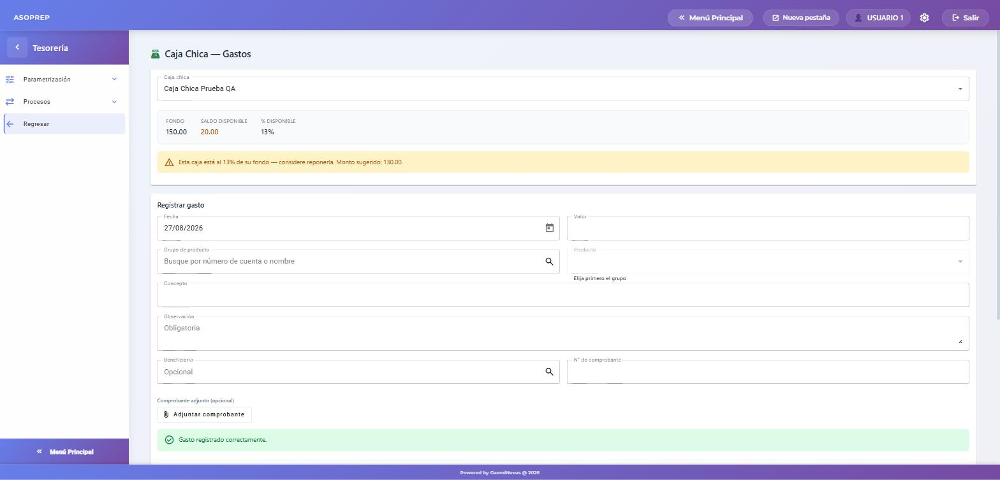
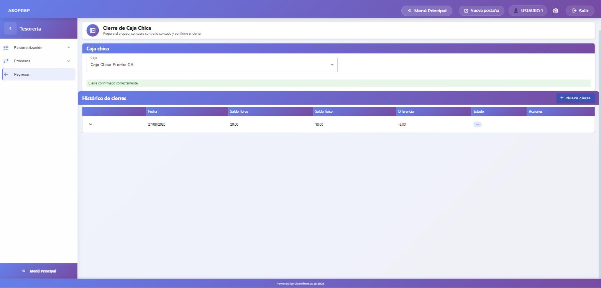

# Caja chica

**Módulo:** Tesorería · **Fecha:** 2026-08-27 · **Tipo:** proceso nuevo

Permite manejar uno o varios fondos de caja chica, cada uno con su nombre, su límite, su cuenta contable y su responsable. El sistema lleva el saldo, avisa cuando hay que reponer, registra los gastos con su comprobante y permite cerrar y cuadrar la caja contra el efectivo contado.

Reemplaza el apaño de manejar la caja chica como si fuera un banco y una cuenta bancaria.

---

## 1. Crear la caja

**Tesorería → Parametrización → Cajas chicas → Nueva caja.**

| Campo | Para qué sirve |
|---|---|
| **Nombre** | Identifica la caja. Puede haber varias (por oficina, por área). |
| **Cuenta contable del fondo** | La cuenta donde vive el dinero de esta caja. Solo se pueden elegir cuentas de movimiento. |
| **Monto del fondo** | El tamaño de la caja. Es el tope: al reponer nunca se pasa de aquí. |
| **Tope por gasto individual** | Máximo que se puede pagar en un solo gasto. Vacío = sin tope. |
| **% de alerta** | Cuando el saldo baje de este porcentaje del fondo, el sistema avisa. Por defecto 20%. |
| **Responsable** y **Custodio** | Quién responde por el efectivo. |
| **Saldo inicial migrado** | **Solo para cajas que ya existían** como cuenta bancaria: registra el saldo que ya está contabilizado, sin generar asiento. Una caja nueva se deja vacío y se abre con el paso 2. |

## 2. Abrir la caja (primer fondeo)

**Tesorería → Procesos → Caja chica → Reposición.**

Al elegir una caja con saldo cero, la pantalla se pone en modo **Apertura** y propone el monto del fondo completo. Se elige la cuenta bancaria de la que sale el dinero y la forma de pago.

La caja chica **no tiene cuenta bancaria de destino**, así que el fondeo se paga con **cheque** o con **débito automático**; no por transferencia. Si la cuenta origen maneja chequera, el sistema indica qué número de cheque va a girar.

El asiento que se genera es: **DEBE la cuenta de la caja / HABER la cuenta del banco**.

## 3. Registrar un gasto

**Tesorería → Procesos → Caja chica → Gastos.**

Al elegir la caja se ve el fondo, el saldo disponible y el porcentaje. Luego:

1. Fecha y **valor** (no puede superar el saldo, ni el tope por gasto si lo hay).
2. **Grupo de producto → producto**: de aquí sale la cuenta contable del gasto.
3. **Concepto** y **observación** — la observación es **obligatoria**: es el sustento de en qué se gastó.
4. Opcionales: beneficiario, número de comprobante y **el comprobante digitalizado** (foto o PDF de la factura o recibo).

El gasto se contabiliza en el acto: **DEBE la cuenta del producto / HABER la cuenta de la caja**.

En cuanto el saldo baja del porcentaje configurado, aparece el aviso con el **monto sugerido a reponer**, y además sale un recordatorio en la parte superior de todas las pantallas de Tesorería.

## 4. Reponer el fondo

Misma pantalla del paso 2. Con la caja ya abierta, se pone en modo **Reposición** y propone reponer exactamente lo gastado (fondo − saldo), para dejar la caja otra vez en su monto completo. El asiento es el mismo que el de la apertura.

## 5. Cerrar y cuadrar la caja

**Tesorería → Procesos → Caja chica → Cierre → Nuevo cierre.**

1. Se elige la fecha y se pulsa **Preparar cierre**. El sistema muestra el período, el saldo inicial, el total de gastos, el total de reposiciones, el **saldo según libros** y la lista de movimientos incluidos.
2. Se cuenta el efectivo y se escribe el **saldo físico contado**. La diferencia se calcula al instante.
3. Si hay diferencia, el sistema pide la **cuenta contable del ajuste** (por ejemplo *OTROS CAJA CHICA*) y avisa del importe que se va a ajustar.
4. **Confirmar cierre**.

Al confirmar: se genera el movimiento de ajuste y su asiento, los movimientos del período quedan marcados con ese cierre y ya no se pueden anular. Un faltante contabiliza **DEBE la cuenta de ajuste / HABER la caja**; un sobrante, al revés.

## 6. Anular

- **Un gasto** se anula desde la lista de movimientos, indicando el motivo: se revierte su asiento y el saldo vuelve. No se puede anular un gasto que ya quedó dentro de un cierre confirmado.
- **Una apertura o reposición** no se anula por su cuenta: hay que **revertir el pago** desde CxP → Pagos por transferencia. Eso anula el asiento, el movimiento de la caja y, si se pagó con cheque, el cheque.
- **Un cierre** se puede anular si es el último: los movimientos vuelven a quedar libres.

## 7. Qué revisar si algo no sale

| Síntoma | Causa |
|---|---|
| No deja registrar el gasto | Falta la observación (es obligatoria), o el valor supera el saldo o el tope por gasto. |
| No deja elegir Transferencia al reponer | Es correcto: la caja no tiene cuenta bancaria de destino. Use cheque o débito automático. |
| No deja registrar con una fecha anterior | Esa fecha cae dentro de un cierre ya confirmado, o dentro de un arqueo en preparación. |
| El saldo no coincide con el efectivo | Para eso es el cierre: registre el saldo contado y el sistema genera el ajuste. |

---

## Comprobado

Flujo completo verificado en el sistema el 2026-08-27, sobre una caja con fondo de $150 y alerta al 20%:

| Paso | Resultado |
|---|---|
| Apertura de $150 con cheque | Movimiento #2 · asiento **DEBE $150 caja `1.1.01.10.01` / HABER $150 banco `1.1.02.05.40`** · cheque N° 2 girado |
| Gasto de $130 (movilización) | Movimiento #3 · asiento **DEBE $130 `4.4.01.15` / HABER $130 caja** · saldo a $20 |
| Alerta | Saltó automáticamente al 13%: *"considere reponerla. Monto sugerido: 130.00"*, y también en el aviso superior del módulo |
| Cierre con saldo físico $18 | Saldo libros $20 · diferencia **−$2** · movimiento de ajuste #4 · asiento **DEBE $2 `4.8.90.90.10` OTROS CAJA CHICA / HABER $2 caja** · los tres movimientos quedaron marcados con el cierre |
