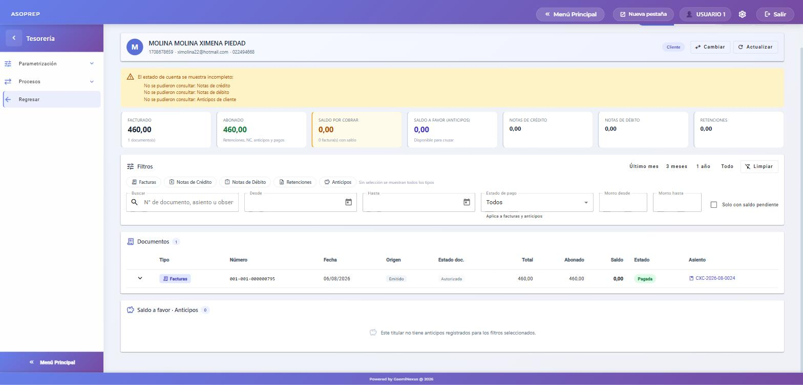
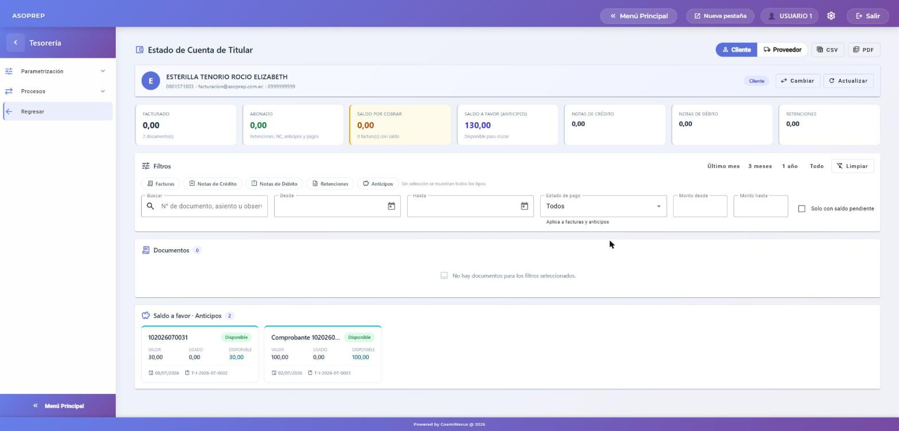

# Estado de cuenta de titular — corrección

**Módulo:** Tesorería · **Fecha:** 2026-08-27 · **Tipo:** corrección de un proceso existente

---

## Qué estaba mal

En el estado de cuenta de un **cliente** no aparecía ninguna factura, aunque el cliente tuviera facturas emitidas y autorizadas. En el de **proveedor** sí aparecían los documentos, lo que hacía parecer que el problema era solo de clientes.

La pantalla descartaba como "anulado" todo documento cuyo estado no fuera `1`. Pero en CxC el estado de una factura es su ciclo de vida ante el SRI —
`1` ingresada, `3` firmada, `4` enviada, **`5` autorizada**, `6` no autorizada — y una factura anulada queda en `0`. Es decir: se ocultaban justamente las facturas válidas y se habrían mostrado las anuladas. En CxP los documentos se graban con estado `1` y nunca cambian, y de ahí venía la diferencia entre los dos estados de cuenta.

Como efecto colateral, tampoco se veían las notas de crédito y débito autorizadas, las retenciones emitidas ni los anticipos confirmados.

## Qué se corrigió

- Cada tipo de documento se evalúa con su propio catálogo de estados: en CxC se ocultan los anulados (`0`) y los no autorizados por el SRI (`6`); en CxP los anulados (`0`); en anticipos los anulados (`3`).
- Se agregó al estado de cuenta de **cliente** la sección de **retenciones recibidas**, que debe considerarse y no se estaba trayendo.
- Se agregó la columna **"Estado doc."**, para poder ver de un vistazo en qué situación está cada documento y por qué aparece o no.

## Cómo verificarlo

1. Entrar a **Tesorería → Procesos → Estado de Cuenta de Titular**.
2. Dejar seleccionada la pestaña **Cliente** (arriba a la derecha) y pulsar **Buscar cliente**.
3. Escribir parte del nombre o la identificación y pulsar **Seleccionar** en la fila del cliente.

El estado de cuenta muestra los totales, los documentos y sus saldos. En la columna **Estado doc.** las facturas válidas aparecen como *Autorizada*; las anuladas ya no se listan ni suman en los totales.

En el ejemplo, el cliente tiene cinco facturas en el sistema: **una autorizada y cuatro anuladas**. La pantalla lista únicamente la autorizada (`001-001-000000795`, $460,00) y el total facturado refleja solo ese documento. Antes de la corrección esta pantalla salía vacía.

Para revisar al mismo titular como proveedor, se usa la pestaña **Proveedor** de la esquina superior derecha.

## Anticipos (saldo a favor)

Los anticipos del titular se muestran en dos lugares: la tarjeta **SALDO A FAVOR (ANTICIPOS)**, con el total disponible, y la seccion **Saldo a favor - Anticipos** al final de la pantalla, con una ficha por anticipo (valor, usado y disponible).

Tampoco aparecian antes de la correccion, y por la misma causa: un anticipo **confirmado** se guarda con estado `2`, y el filtro anterior solo dejaba pasar el `1`. Es decir, se ocultaban justamente los anticipos que ya son dinero disponible y solo se habrian visto los ingresados sin confirmar. Ahora en anticipos se oculta unicamente el estado `3` (anulado).

En el ejemplo, el cliente tiene dos anticipos disponibles de $30,00 y $100,00: la tarjeta suma **$130,00** y las dos fichas aparecen en el detalle.

## Nota

Durante las pruebas aparecía un aviso amarillo *"El estado de cuenta se muestra incompleto"* cuando el titular no tenía notas de crédito, notas de débito o anticipos. No era una falla: el sistema informa "sin registros" con un mensaje que la pantalla no distinguía de un error. **Ya está corregido**, y el aviso solo aparece ante un problema real.
