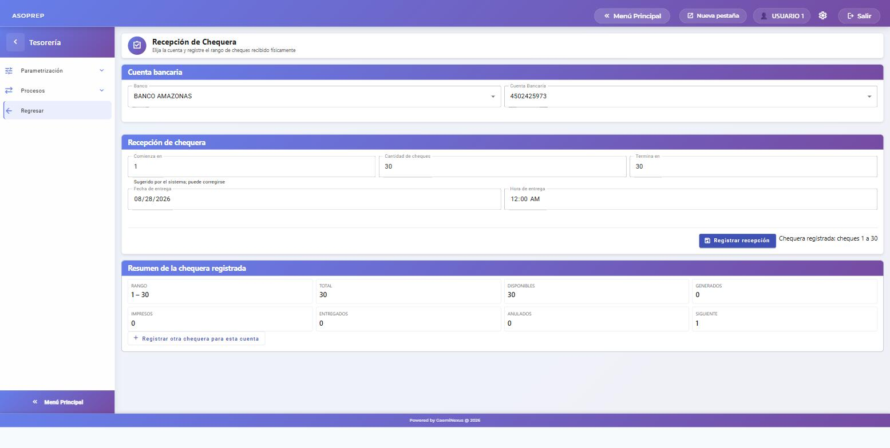
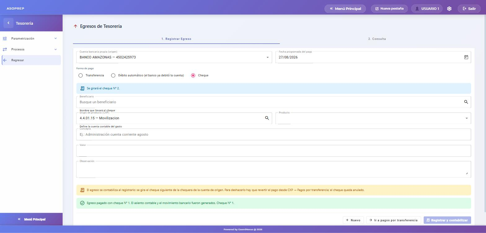
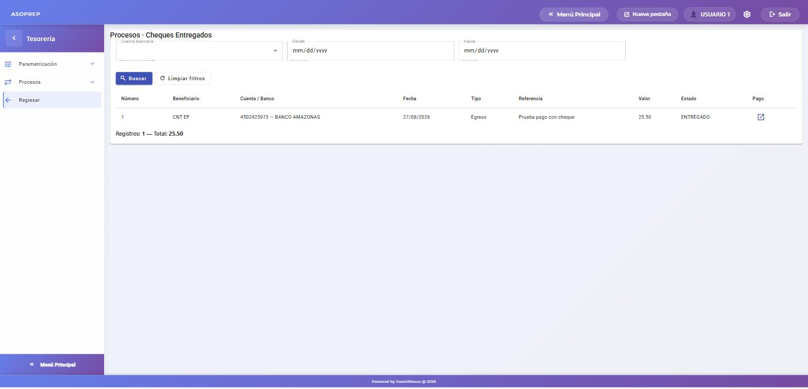

# Pago con cheque

**Módulo:** Tesorería · **Fecha:** 2026-08-27 · **Tipo:** proceso nuevo

Permite pagar con cheque desde cualquier cuenta bancaria que maneje chequera, llevando el control de los cheques: cuáles quedan disponibles, cuál toca girar, cuáles se imprimieron, se entregaron o se anularon. Habilitar el cheque **no quita** las otras formas de pago: la misma cuenta sigue sirviendo para transferencias y débitos automáticos.

---

## 1. Habilitar la chequera en la cuenta bancaria

**Tesorería → Parametrización → Bancos → Mis bancos → Cuentas bancarias.**

Elegir el banco, seleccionar la cuenta, pulsar **Editar** y marcar **Maneja chequera**. Guardar con **Actualizar**.

En el listado de cuentas, la columna **CHEQUERA** muestra un visto en las cuentas habilitadas. Mientras la cuenta no esté marcada, la forma de pago Cheque no aparece en ninguna pantalla de pago.

## 2. Registrar la chequera recibida del banco

**Tesorería → Parametrización → Bancos → Mis bancos → Chequeras → Recepción.**

1. Elegir el banco y la cuenta. Solo se listan las cuentas que manejan chequera.
2. El campo **Comienza en** se llena solo con el número sugerido — el siguiente al último cheque de la chequera anterior. Puede corregirse.
3. Escribir la **Cantidad de cheques**; el campo *Termina en* se calcula solo (y al revés).
4. Poner la fecha de entrega y pulsar **Registrar recepción**.

El sistema crea un cheque por cada número del rango, todos disponibles, y muestra el resumen. No se admiten rangos que se solapen con otra chequera de la misma cuenta.

## 3. Pagar con cheque

Funciona igual en las tres pantallas donde sale dinero: **pagos por transferencia (CxP)**, **egresos de tesorería** y **anticipos a proveedor**.

1. Elegir la **cuenta bancaria de origen**. Si maneja chequera, aparece la opción **Cheque** en Forma de pago.
2. Al marcar Cheque, el sistema avisa **qué número se va a girar** y el beneficiario pasa a ser *el nombre que llevará el cheque*. La cuenta bancaria del beneficiario deja de pedirse: en un cheque no hace falta.
3. Completar el resto (beneficiario, grupo de producto, producto, concepto, valor) y pulsar **Registrar y contabilizar**.

A diferencia de la transferencia, **el pago con cheque se contabiliza en el acto**: el cheque girado ya redujo el banco en libros. El sistema genera el asiento y el movimiento bancario, y deja el número de cheque anotado en la glosa del asiento y en la descripción del movimiento. El movimiento queda marcado como *cheque girado y no cobrado*, que es como lo espera la conciliación bancaria.

Los pagos con cheque **no entran** en el archivo del banco: no aparecen al generar un lote.

## 4. Impresión y entrega

**Tesorería → Procesos → Pagos → Procesos.**

- **Cheques generados**: los cheques girados y todavía no impresos. Se marcan los que se imprimieron y se pulsa *Marcar impresos*.
- **Cheques impresos**: se marcan los entregados al beneficiario y se pulsa *Marcar entregados*.
- **Cheques entregados**: consulta del histórico.

En las tres pantallas se ve el número, el beneficiario, la cuenta y el banco, el valor, el tipo de pago que lo originó (egreso, factura, anticipo) y su referencia.

> **Nota sobre el filtro de fechas:** filtra por la fecha en que se giró el cheque. Los cheques que aún no se han usado no tienen esa fecha, así que si se pone un rango desaparecen de la lista. Para verlos, dejar las fechas vacías.

## 5. Anular un cheque

Hay dos casos distintos:

- **Cheque sin usar** (dañado, error de tipeo): se anula desde **Parametrización → Bancos → Mis bancos → Chequeras → Chequera**, eligiendo la chequera y el cheque, e indicando el motivo. El número queda anulado y no se vuelve a ofrecer.
- **Cheque ya girado**: no se anula por su cuenta. Hay que **revertir el pago** desde CxP → Pagos por transferencia; al revertirlo, el sistema anula el asiento, el movimiento bancario y el cheque, con el motivo *pago reversado*. Un cheque anulado nunca se reutiliza.

## 6. Qué revisar si algo no sale

| Síntoma | Causa |
|---|---|
| No aparece la opción **Cheque** en la forma de pago | La cuenta de origen no tiene marcado *Maneja chequera* (paso 1). |
| *"La cuenta no tiene cheques disponibles"* | Se acabaron los cheques de la chequera: registrar la nueva (paso 2). |
| El listado de cheques sale vacío | Hay un rango de fechas puesto y los cheques buscados aún no se han girado (ver la nota del paso 4). |
| Un egreso con cheque no deja registrarse | Falta el beneficiario: el cheque se gira a su nombre y es obligatorio. |

---

## Comprobado

Flujo completo verificado en el sistema el 2026-08-27: cuenta habilitada → chequera de 30 cheques registrada → egreso de $25,50 a CNT EP pagado con el cheque N° 1 → cheque marcado impreso y luego entregado.

La contabilidad quedó correcta: asiento con **DEBE $25,50 a la cuenta del grupo del producto (4.4.01.15)** y **HABER $25,50 al banco (1.1.02.05.40)**, glosa *"Pago egreso tesorería (cheque) | Concepto: … | Ref: CHQ-1 | Valor: $25.50 | Cheque N° 1 Cta 4502425973"*, y movimiento bancario tipo *cheques girados y no cobrados* con el número de cheque.
